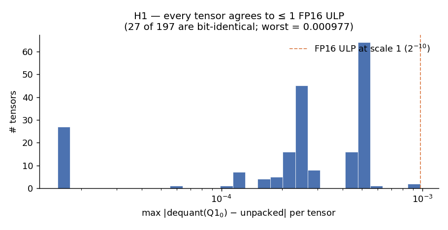
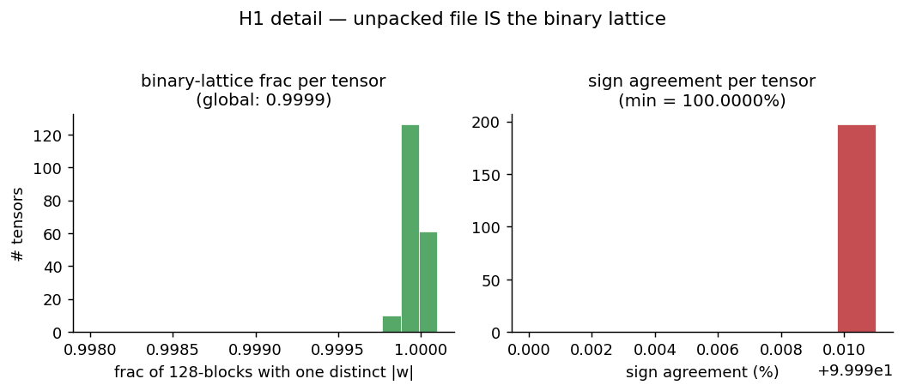
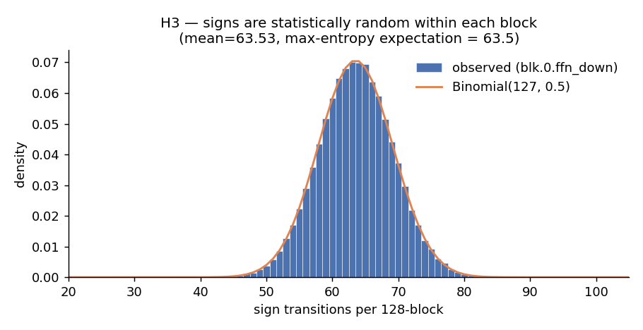
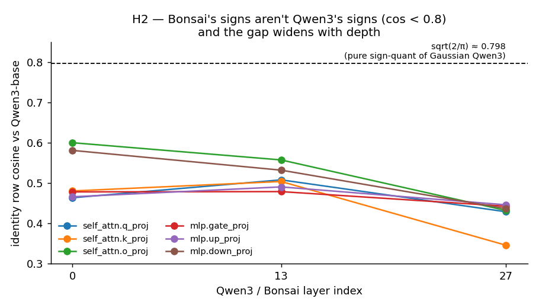
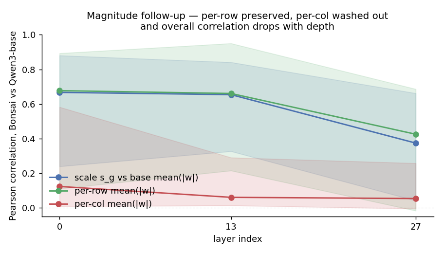
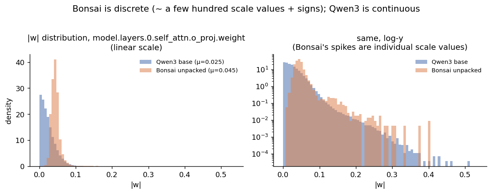
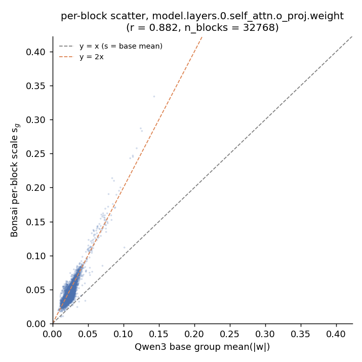

# Bonsai-1.7B mini report

> What is PrismML's "1-bit Bonsai" actually doing to Qwen3?
> Empirical, falsifiable, reproducible. Source bytes from
> [`models-bonsai-1.7B-r5`](https://github.com/TG-Techie/reversing-bonsai/releases/tag/models-bonsai-1.7B-r5).
> Numbers per tensor live in `01..06_*.txt` next to this file. Figures via
> `src/make_mini_report_figures.py`.

## TL;DR

Bonsai-1.7B is **Qwen3-1.7B retrained onto a strict ±s\_g binary lattice
via QAT** — same architecture, same channel ordering, same head structure.
Two of the three "could there be a layout trick?" hypotheses are firmly
rejected; the remaining one is firmly confirmed (and it's the boring one:
the FP16 "unpacked" file is just `dequantize(Q1_0)` cast to FP16). The
"proprietary Caltech IP" the paper alludes to is the QAT recipe, not the
weight format.

| # | claim | verdict |
| - | - | - |
| **H1** | `dequant(Bonsai-Q1_0)` ≡ `Bonsai-unpacked` (FP16) elementwise | ✅ confirmed |
| **H2** | Bonsai-unpacked is Qwen3 after channel permutation | ❌ rejected (no perm helps) |
| **H3** | Signs within each 128-block are sorted/clustered | ❌ rejected (random) |

The follow-up question — *do magnitudes inherit anything from Qwen3?* —
gets a partial yes: row-magnitude profile is preserved, column-magnitude
profile is structurally erased, and the correlation drops with depth.

## H1 — the unpacked file IS the binary lattice



Across all 197 Q1\_0 tensors, the worst element-wise disagreement between
`dequantize(Q1_0_GGUF)` and `Bonsai-unpacked.safetensors` is **9.77e-4** —
exactly one FP16 ULP at the local scale. Twenty-seven tensors are
bit-identical (max diff = 0). Every tensor agrees on signs at 100.0000%,
and 99.995% of all 13.4M groups have a single distinct |w|.



Implication: there's no second high-precision representation. The "unpacked"
repo is a redundant artifact that exists for runtimes that can't yet decode
Q1\_0\_g128 inline.

## H3 — sign layout inside a 128-block is random



Aggregating all 98,304 blocks of one tensor: mean sign-transitions per block
**63.53**, vs the max-entropy expectation of 63.5 from `Binomial(127, 0.5)`.
Lag-1 sign autocorrelation is `+1e-4`. Across the whole model, **0.00%** of
blocks have ≤1 transition. Nothing in the layout is sorted, clustered, or
periodic.

So Bonsai isn't using a clever channel reordering to make signs
run-length-compressible. The information is in *which* signs the model
chose, not *where* it put them.

## H2 — channels aren't permuted, signs aren't Qwen3's



Row-cosine vs Qwen3-base lands in **0.43–0.60** across early/mid/late
blocks. Two takeaways:

- **No permutation helps.** Greedy best-row-permutation cosine matches the
  identity cosine to 1e-3 on every layer; the search literally cannot
  improve on identity. Channel ordering is preserved.
- **Signs were re-learned.** Pure post-training sign-quant of a Gaussian
  Qwen3 would yield row-cosine `sqrt(2/π) ≈ 0.80`. Bonsai is well below
  that, so on the order of 25–30% of signs flipped during QAT. The gap
  widens with depth (block 0 ≈ 0.60 → block 27 ≈ 0.43), which is where
  later-layer features are most task-specific.

## Magnitude follow-up — per-row preserved, per-col erased



Three Pearson correlations between Bonsai-unpacked and Qwen3-base, by
depth:

- **Per-block scale `s_g` vs base group mean(|w|)**: +0.67 → +0.65 → **+0.37**.
  Bonsai's QAT clearly *uses* Qwen3's per-group magnitude as a prior but
  re-learns its own scales — and re-learns them harder in late layers.
- **Per-output-row mean(|w|)**: +0.68 → +0.43. Per-output-channel magnitude
  variation survives compression.
- **Per-input-column mean(|w|)**: +0.12 → +0.05 across depth. Q1\_0 stores
  one scale per 128-element block along the input dim, so within a block
  all 128 input columns must share a magnitude. The format physically
  cannot represent fine-grained per-input-channel variation, and QAT
  visibly accepted that loss.

Concretely, here's the |w| distribution for `model.layers.0.self_attn.o_proj.weight`:



Qwen3's |w| is continuous and Gaussian-shaped. Bonsai's is **discrete**:
each ~300 unique scale values (1 per 128-block) shows up as a spike on
log-y. Mean |w| for Bonsai is 1.94× larger than Qwen3's median across
tensors (and 3× on `attn_v`); the binary lattice has to amplify what
survives because it gave up everything else.

The per-block scatter for the same tensor:



`r = 0.88` for that one matrix, with the cloud sitting between `y = x` and
`y = 2x` — i.e. Bonsai scales track Qwen3 group means but live consistently
above them. Pure L2-optimal sign-quant of a Gaussian would predict the
slope `sqrt(π/2) ≈ 1.25`; the observed ~2× says QAT pushed scales harder
than that.

## Putting it together

Bonsai-1.7B is best described as: *Qwen3-1.7B with the matrix-heavy weights
replaced by signs trained on the binary lattice* `{±s_g}`. Tokenizer +
norms + small q/k per-head scale tensors are inherited; the embedding loses
267 reserved-vocab entries; FFN intermediate dim and per-head channel
ordering are unchanged. The only things that fundamentally differ from
post-training sign-quant are:

1. ~25–30% of signs were flipped during QAT, especially in late layers.
2. Per-block magnitudes were learned (with Qwen3's group magnitude as a
   prior, weight ~0.65 early to ~0.37 late).
3. Per-input-channel magnitude variation is structurally erased — the
   format can't carry it.

That matches the paper's reported 9-point accuracy gap (Qwen3-8B 79.3 →
Bonsai-8B 70.5) at 1/14× the storage. Pure sign-quant would lose far more;
QAT plus a binary-lattice constraint is the cheapest plausible recipe that
preserves this much.

## Reproduce

```sh
scripts/fetch_models_from_release.sh models-bonsai-1.7B-r5
uv sync

uv run python src/gguf_inspect.py models/q1/Bonsai-1.7B-Q1_0.gguf --tensors \
    > reports/bonsai-1.7B/01_metadata.txt
uv run python src/analyze_q1_0.py models/q1/Bonsai-1.7B-Q1_0.gguf --top 0 \
    > reports/bonsai-1.7B/02_q1_0_analysis.txt
uv run python src/compare_q1_dequant_vs_unpacked.py \
    models/q1/Bonsai-1.7B-Q1_0.gguf models/unpacked/model.safetensors \
    > reports/bonsai-1.7B/05_dequant_vs_unpacked.txt
uv run python src/compare_unpacked_vs_qwen3.py \
    models/unpacked/model.safetensors \
    models/base/model-00001-of-00002.safetensors \
    --filter "model.layers.0." \
    > reports/bonsai-1.7B/03_unpacked_vs_qwen3.txt
uv run python src/compare_magnitudes.py \
    models/q1/Bonsai-1.7B-Q1_0.gguf \
    models/unpacked/model.safetensors \
    models/base/model-00001-of-00002.safetensors \
    --filter "blk.0." \
    > reports/bonsai-1.7B/06_magnitudes.txt

uv run python src/make_mini_report_figures.py
```
